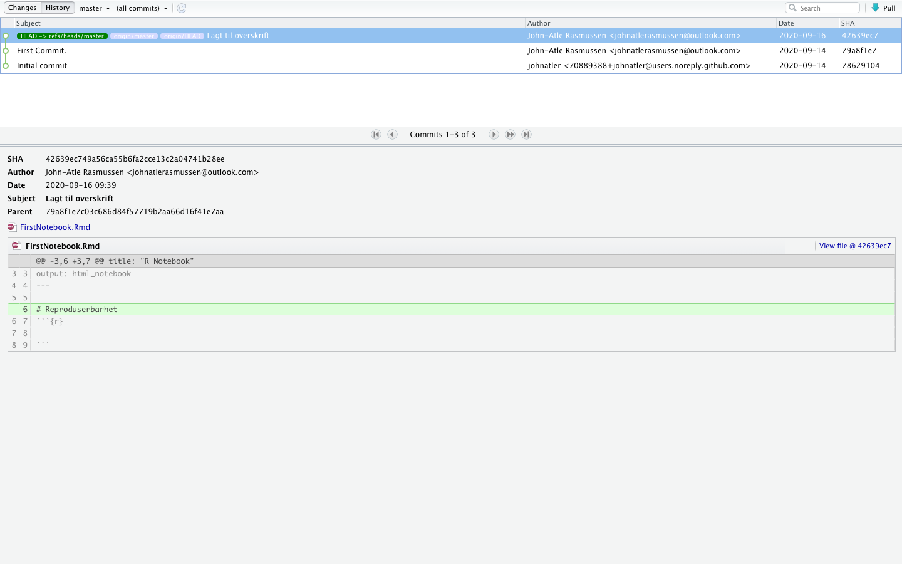

# Generell info til oppgaven vår:  
Dersom vi ønsker å fortsette på linja under trenger en bare ta to mellomrom etter teksten..  
_**Italic og bold**_  
**Bold**  
_Italic_

Her er et sitat:  

> Dette er et sitat.

Her er en ordnet liste på  2 nivå:  

1. Punkt 1
    + Punkt 1.2
1. Punkt 2
    + Punkt 2.2
    
Header   | Second Header
-------- |   -------------
123      |  123455
123      |  12434 

# Innledning
Reproduserbarhet er viktig for å skape troverdighet av funnnene som forskes på. Det vil si at om du har samme datasett, skal funnene være ganske like for at vi kan si at funnene er reproduserbare. 

Reproduserbarhet er aktuelt i R notebook der en kan reprodusere tallmateriale så lenge en har lastet alle de riktige pakkene. Ved samme datasett skal en få omtrentlig samme verdier om en tester datasettet ved flere anledninger inne i R Notebook.

# Litteraturgjennomgang
### Replikerbarhet / Reproduserbarhet

Det å kunne replikere resultater og konklusjoner fra en uavhengig studie til en annen, blir i vitenskapen sett på som gullstandarden (@jasny2011). På grunn av misforståelser og bruk om hverandre i forhold til replikerbarhet og reproduserbarhet, har National Science Foundation (NSF), satt seg ned for å klare opp i dette (@bollen2015). For å kunne vise til robust og pålitelig forskning har de kommet frem til at dette betyr at forskningen er _reproduserbar_, _replikerbar_ og _generalisert_. 
_Replikerbarhet_ refereres til som evnen til at en forsker kan **duplisere** resultatene av en tidligere studie ved hjelp av samme prosedyrer ved bruk av **ny data** som er samlet inn (@bollen2015). Det vil si at dersom en forsker samler inn ny data for å analysere barnedødeligheten i Norge, så vil en kunne få samme resultater som ved noen som har gjort det tidligere ved bruk av de samme prosedyrene.

_Reproduserbarhet_ er videre beskrevet som det å kunne få samme resultater og konklusjoner dersom en analyserer **samme materiale** tatt ut av en populasjon, ved hjelp av **samme prosedyrer** [@bollen2015]. 

Reproduserbarhet er _**nødvendig**_ for å oppnå replikerbarhet, men likevel ikke nok til å oppnå dette. Om reproduserbarhet er noe som burde være et minstekrav for publisering er videre noe som har vært oppe til debatt de siste årene [@peng2011]. 

Når det kommer til _generalisering_ så refereres det til hvorvidt resultatene av en studie kan overføres til andre kontekster eller populasjoner som er ulik den orginale [@bollen2015].

Robusthet og pålitelighet ses på som selve fundamentet for vitenskapelig utvikling og fremgang [@bollen2015].

Pupliseringsskjevhet er videre noe som forskning har fokusert på. Publiseringsskjevhet refereres til sannsynligheten for at en studie blir publisert, basert på resultatene. Er relativt få publikasjoner der en ikke kan forkaste nullhypotesen, for eksempel at en medisin ikke har effekt.  Worst case - scenario kan da bli at forskningsjournaler blir en stor samling av type 1-feil. Type 1-feil er at en forkaster nullhypotesen selv om den i virkeligheten er sann. Et slikt scenario blir ofte kalt "File Drawer Problem" [@rosenthal1979]. For illustrasjonens del kan det i realiteten være 100 upubliserte studier som ikke kan forkaste H0 om at en medisin har null effekt, mens 4 som forkaster denne H0 kan være publisert.Dette kan spre uriktig informasjon, og føre til dårlige investeringer i blant annet politiske reformer som har veldig liten effekt og dårlige forskningsprosjekter, samt begrense et tidsskrift sin troverdighet [@simmons2011]. 

### Problemets omfang

- **Vil dagens løsning med arkiv av data og event. programkode hos tidsskriftene kunne løse problemet?**

For å løse problemer knyttet til reproduserbarhet og replikerbarhet, var løsningen på 80-tallet å opprette arkiver i tidsskriftene for kode og data fra studiene som blir gjort. Dette er brukt av flere store  tidsskrifter lenge. @mccullough2008 fant likevel at de fleste store tidsskrifter ikke oppfylte reproduserbarhet og replikerbarhet, og at resultatene ikke kunne bli reprodusert ved bruk av dataen og koden som lå ved studiene. Dette var temmelig nedslående resultater, og det kan se ut som dagens løsning ikke fungerer; problemet er fortsatt der. 

Datacite prøvde videre å lage en global database med data fra all forskning, der internasjonalt samarbeid var i fokus [@brase2009]. EU har også vært inne med en løsning [@eu2015], og dette er følgelig noe som arbeides med videre per dags dato. 

### Mulig løsning

**Computable documents**  
En annen mulig løsning er at koden ligger som en integrert part i forskningsartiklene, herunder at de inneholder tekst, samt kode for lese data, kalkulere modeller, teste og vise resultater. Dette vil da gi et fullstendig reproduserbart dokument [@knuth1992]. 

Et kompendium har en eller flere selvforsynte livedokumenter som kan regenerere resultater ned til den minste detalj av andre [@gentleman2007].Kan da stole på denne dataen og studere denne.  

**Dynamic document**  
Dynamisk dokument er en ordnet sammensetning av såkalte kode- og tekst-chunks som beskriver og diskuterer et problem og en løsning. 

**Code chunk**  
"Code chunk" er en linje med kode som kan kjøres. 

**Text chunk**  
"Text chunk" er en linje med tekst. 

**R Notebooks**  
En R Notebook er et R Markdown dokument med chunks som kan bli kjørt både individuelt og sammen, med synlig output under med en gang etter den er kjørt. 

# Analyse
### Overskrift. 
Tekst. @eu2015

### Neste overskrift.
Tekst.

# Konklusjon
Tekst.

# Litteraturliste

# Appendiks
Her kommer et bilde av git history. Vi må ha minst 10 commits, 3 branches og gjerne en merge conflict for stjerne i boka. Til info så ska dette bilde ligge under appendiks. 

