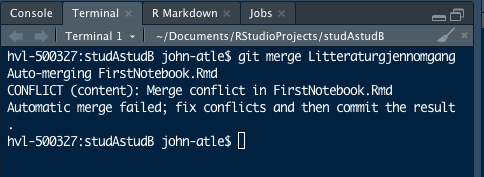

#  <span style="color: mediumblue;">Innholdsfortegnelse</span>

1. Innledning
1. Litteraturgjennomgang
    + Replikerbarhet/Reproduserbarhet
    + Problemets omfang
    + Mulig løsning
1. Analyse
    + Løser R notebooks problemet med reproduserbarhet?
    + Eksempler på code chunks og text chunk i R notebook.
    + Har forskere insentiver til å være "reproduserbare", eller må de tvinges?
    + Er økt reproduserbarhet noe som vil tvinge seg frem eller er dagens økte interesse bare et blaff?
    + Kan reproduserbarhet ha relevans i sektorer utenfor akademia?
1. Konklusjon
1. Litteraturliste
1. Appendiks


# <span style="color: mediumblue;">Innledning</span>
Reproduserbarhet og replikerbarhet er særdeles viktig for å skape troverdighet av funn som er gjort i forskningssammenheng, men er samtidig også essensiell for å kunne videreutvikle forskning. At forskere kan gjenskape andres arbeid og resultater, enten basert på samme datasett eller lignende datasett, er dermed viktig for å kunne bekrefte funnene som er gjort. Å ta enhver forskning for god fisk, uten korrekt og utfyllendende dokumentasjon, kan i ytterste konsekvens få fatale følger.

Reproduserbarhet og replikerbarhet er noe av grunnnen til at ulike programvarer som R Notebook har sett dagens lys. Ved å ta i bruk programvare som R Notebook kan en reprodusere tallmateriale og resultater, så lenge en har lastet ned alle de riktige datapakkene. Ved samme datasett skal en da kunne få omtrentlig samme verdier om en tester datasettet ved flere anledninger inne i R Notebook. En kan likevel stille spørsmål til om dette programmet er godt nok til å unngå feil når det kommer til reproduserbarhet?


# <span style="color: mediumblue;">Litteraturgjennomgang</span>
### Replikerbarhet / Reproduserbarhet

Det å kunne replikere resultater og konklusjoner fra en uavhengig studie til en annen, blir i vitenskapen sett på som gullstandarden (@jasny2011). På grunn av misforståelser og bruk om hverandre i forhold til replikerbarhet og reproduserbarhet, har National Science Foundation (NSF), satt seg ned for å klare opp i dette (@bollen2015). For å kunne vise til robust og pålitelig forskning har de kommet frem til at dette betyr at forskningen er _reproduserbar_, _replikerbar_ og _generalisert_. 

_Replikerbarhet_ refereres til som evnen til at en forsker kan **duplisere** resultatene av en tidligere studie ved hjelp av samme prosedyrer ved bruk av **ny data** som er samlet inn (@bollen2015). Det vil si at dersom en forsker samler inn ny data for å analysere barnedødeligheten i Norge, så vil en kunne få samme resultater som ved noen som har gjort det tidligere ved bruk av de samme prosedyrene.

> _Replikerbarhet_ - Det å kunne duplisere resultatene av en tidl. studie vha. samme prosedyrer basert på ny data som er samlet inn [@bollen2015].

_Reproduserbarhet_ er videre beskrevet som det å kunne få samme resultater og konklusjoner dersom en analyserer **samme materiale** tatt ut av en populasjon, ved hjelp av **samme prosedyrer** [@bollen2015]. 


> _Reproduserbarhet_ - Det å kunne få samme resultater og konklusjoner vha. samme prosedyrer på samme materiale [@bollen2015]. 


Reproduserbarhet er _**nødvendig**_ for å oppnå replikerbarhet, men likevel ikke nok til å oppnå dette. Om reproduserbarhet er noe som burde være et minstekrav for publisering er videre noe som har vært oppe til debatt de siste årene [@peng2011]. 

Når det kommer til _generalisering_ så refereres det til hvorvidt resultatene av en studie kan overføres til andre kontekster eller populasjoner som er ulik den orginale [@bollen2015].

Robusthet og pålitelighet ses på som selve fundamentet for vitenskapelig utvikling og fremgang [@bollen2015].

_Pupliseringsskjevhet_ er videre noe som forskning har fokusert på. Publiseringsskjevhet refereres til sannsynligheten for at en studie blir publisert, basert på resultatene. Er relativt få publikasjoner der en ikke kan forkaste nullhypotesen, for eksempel at en medisin ikke har effekt.  Worst case - scenario kan da bli at forskningsjournaler blir en stor samling av type 1-feil. Type 1-feil er at en forkaster nullhypotesen selv om den i virkeligheten er sann. Et slikt scenario blir ofte kalt "File Drawer Problem" [@rosenthal1979]. For illustrasjonens del kan det i realiteten være 100 upubliserte studier som ikke kan forkaste H0 om at en medisin har null effekt, mens 4 som forkaster denne H0 kan være publisert.Dette kan spre uriktig informasjon, og føre til dårlige investeringer i blant annet politiske reformer som har veldig liten effekt og dårlige forskningsprosjekter, samt begrense et tidsskrift sin troverdighet [@simmons2011]. 

### Problemets omfang

**Vil dagens løsning med arkiv av data og event. programkode hos tidsskriftene kunne løse problemet?**

For å løse problemer knyttet til reproduserbarhet og replikerbarhet, var løsningen på 80-tallet å opprette arkiver i tidsskriftene for kode og data fra studiene som blir gjort. Dette er brukt av flere store  tidsskrifter lenge. @mccullough2008 fant likevel at de fleste store tidsskrifter ikke oppfylte reproduserbarhet og replikerbarhet, og at resultatene ikke kunne bli reprodusert ved bruk av dataen og koden som lå ved studiene. Dette var temmelig nedslående resultater, og det kan se ut som dagens løsning ikke fungerer; problemet er fortsatt der. 

Datacite prøvde videre å lage en global database med data fra all forskning, der internasjonalt samarbeid var i fokus [@brase2009]. EU har også vært inne med en løsning [@eu2015], og dette er følgelig noe som arbeides med videre per dags dato. 


### Mulig løsning

**Computable documents**  
En annen mulig løsning på problemet er at koden ligger som en integrert part i forskningsartiklene som blir produsert, herunder at de i tillegg til å inneholde tekst, inneholder kode for lese data, kalkulere modeller, teste og vise resultater. Dette vil da kunne gi et fullstendig reproduserbart dokument [@knuth1992]. 

Videre refereres det også til såkalte kompendium. Et kompendium har en eller flere selvforsynte livedokumenter som kan regenerere resultater ned til den minste detalj av andre [@gentleman2007]. Dette gjør at en kan stole på analysene som er gjort, bygge videre på resultatene og utvikle forskningen videre. 

**Dynamic document**  
Dynamisk dokument er en ordnet sammensetning av såkalte kode- og tekst-chunks som beskriver og diskuterer et problem og en løsning. 

**Code chunk**  
"Code chunk" er en linje med kode som kan kjøres i R. En kan for eksempel kjøre en code chunk med utgangspunkt i et datasett og få ut et plot med for eksempel sammenhengen mellom motorstørrelse og bremselengde for bilmodeller på 1970-tallet. 


**Text chunk**  
"Text chunk" er en linje med ren tekst. Denne inneholder ikke kode slik som code chunk, og et eksempel er dette avsnittet dersom det er åpnet i Rstudio.


**R Notebooks**  
En R Notebook er et R Markdown dokument med chunks som kan bli kjørt både individuelt og sammen, med synlig output under med en gang etter den er kjørt. Dokumentet vi nå skriver i er et eksempel på dette og den store fordelen med et slikt dokument er at vi kan kombinere kode og tekst om hverandre. Dette er særlig gunstig da vi får samlet både fremgangsmåte i form av kode og tekst som beskriver hva vi har gjort, eventuelt kommentarer på resultater. R Notebook kan på denne måten være gunstig for å sikre at andre forstår hva vi har gjort og til å gjøre studiene reproduserbare. 

# <span style="color: mediumblue;">Analyse</span>


### Løser R notebooks problemet med reproduserbarhet?

Som tidligere nevnt er R notebook et nyttig verktøy når det kommer til kvaliteten av reproduserbarhet. Man skal kunne få samme resultater dersom materialet som brukes er likt [@bollen2015]. Likevel løser ikke R notebook hele problemet tilknyttet reproduserbarhet. Mange store tidsskrifter har følgelig hatt problemer med å oppfylle reproduserbarhet. Problemet er fortsatt ikke helt løst og vi kan dermed si at R notebooks til nå bare løser delvis problemet, men dessverre ikke hele. [@mccullough2008]

### Eksempler på code chunks og text chunk i R notebook. 
```{r}
plot(cars)

# Her er et eksempel på en code chunk som viser grafisk oversikt for datsettet cars. Denne meldingen er en tekst chunk.
```


### Har forskere insentiver til å være "reproduserbare", eller må de tvinges?
Hvor ny forskningen er, er noe som ofte prioriteres fremfor selve replikerbarheten til forskningen. Det nye og revolusjonerende, eller banebrytende om du vil, er ofte noe som havner i fokus. Dette taler for at forskerne ikke har insentiver på å være reproduserbare. Dette ofte siden nye innovative ideer og forskning går utpå dato og blir ersattet av nye ideer og nytt materiale  [@opensciencecollaboration2015]

### Er økt reproduserbarhet noe som vil tvinge seg frem eller er dagens økte interesse bare et blaff?

For å unngå problemene med feilforskning vil nok interessen for reproduserbarhet øke i årene fremover. Da reproduserbarhet har forbedret seg mye siden 1980-tallet, men fortsatt er langt fra perfeksjonert, så vil dette tale for at interessen for å gjøre reproduserbarheten best mulig vil øke. Med å forbedre dette kan bedrifter blant annet spare mye tid knyttet til å sjekke om forskning stemmer overens med de første funnene, i tillegg til at samfunnet som helhet kan unngå dyre investeringer i politikk som ikke fungerer. Et annet moment er at et fokus på resproduserbarhet vil kunne øke mengden informasjon i omløp og gi oss et riktigere bilde av for eksempel hvor godt ulike typer medisiner fungerer. 


### Kan reproduserbarhet ha relevans i sektorer utenfor akademia?

Reproduserbarhet kan også ha relevans i sektorer utenfor akademia. Dette kan for eksempel være nevnte eksempel med medisiner, men også politiske vedtak. Et eksempel på dette er studier som kommer frem til en positiv effekt av at brukere av el-bil skal begynne å betale mer bompenger for å få inn mer penger til veiarbeid og samtidig opprettholde eller øke klimavennligheten i trafikken. Ved innføringen av et slikt tiltak kan det i verste fall være motsatt effekt, i form av at andelen som eier el-bil synker, og en får heller færre penger inn og høyere forurensning fra de som nå kjører bensin-/dieselbil isteden. 


# <span style="color: mediumblue;">Konklusjon</span>

# Konklusjon

I denne oppgaven har vi sett på reproduserbarhet og replikerbarhet og de sine betydninger når det kommer til forskning og spesielt knyttet til R Notebooks. Dataprogram som dette har helt åpenbart forbedret bruken av reproduserbarhet og replikerbarhet innen forskning, men likevel er det et betydelig forbedringspotensial. Ved ytterligere og nødvendige forbedringer vil program som R Notebooks kunne bli bedre rustet til å gjøre reproduserbarheten og replikerbarheten enda bedre på sikt. Dette vil komme både oss og forskningen til gode. 

# <span style="color: mediumblue;">Litteraturliste</span>
<div id="refs"></DIV>


# <span style="color: mediumblue;">Appendiks</span>

Bilde    | Forklaring
-------- |   -------------
      |  _Merge conflict - fikset ved å rette opp i konflikt og kommando "git add ." etterpå i terminalvinduet._
   |   _Her er et bilde av minst 10 commits og 3 branches._ 


      

